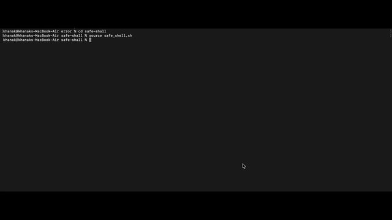
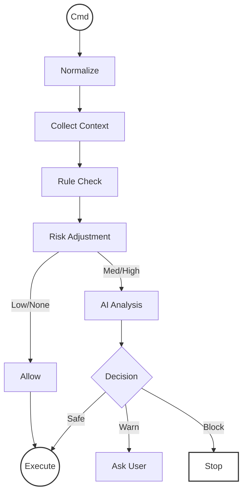

# Safe Shell

**AI-powered safety layer for your terminal.** Intercepts commands, analyzes risk, and blocks dangerous actions before they run.

## 🎥 Demo

[](https://drive.google.com/file/d/11q7pcAQ3gJJUWJaf1HvD5XK5PL_A9NRz/view?usp=sharing)

> **Note:** Click the image or [here](https://drive.google.com/file/d/11q7pcAQ3gJJUWJaf1HvD5XK5PL_A9NRz/view?usp=sharing) to watch the high-quality demo video.

## ⚡ Setup

1. **Install Dependencies**
   ```bash
   pip install -r requirements.txt
   ```
2. **Configure Environment**
   Create a `.env` file with your Gemini API key:
   ```env
   GOOGLE_API_KEY=your_api_key_here
   ```
3. **Activate**
   Source the integration script (add to `~/.zshrc` for persistence):
   ```zsh
   source safe_shell.sh
   ```

## 🚀 Usage

Just use your terminal as normal. Safe Shell runs silently in the background.

- **Safe Commands**: Run instantly.
  ```bash
  echo "Hello"  # ✅ Runs immediately
  ```
- **Risky Commands**: Prompt for confirmation.
  ```bash
  npm install   # ⚠️  Ask: Execute? [y/N]
  ```
- **Dangerous Commands**: Blocked by default.
  ```bash
  rm -rf /      # 🚫 BLOCK
  ```

## 🧠 Workflow


